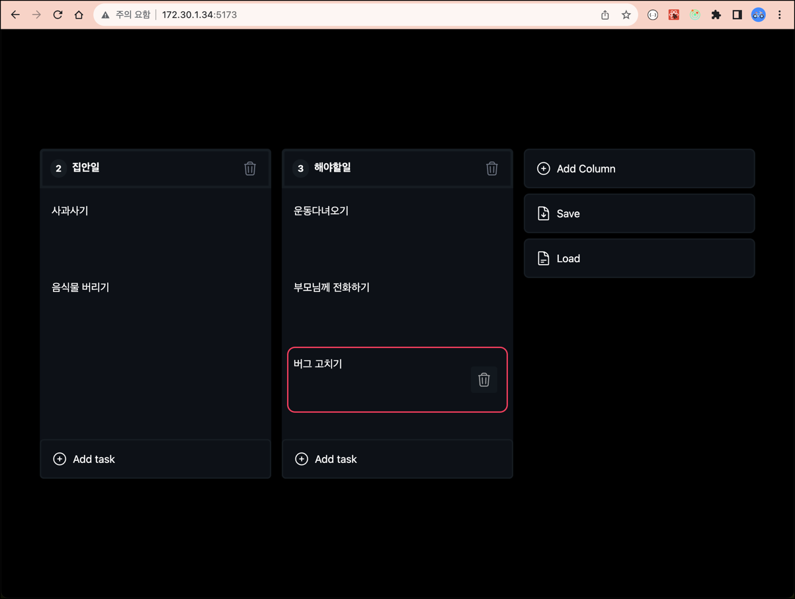

# cz-kanban

@dnd-kit, redux, mobx 를 이용한 kanban board

## 지원되는 기능

- 저장과 불러오기 기능 (localStorage)
- column 제목, task 제목 변경과 삭제
- column 간 순서 변경, task 간 순서 변경
- redux, mobx 를 이용한 상태관리 (각각)

## 디자인 출처

[YOUTUBE](https://www.youtube.com/watch?v=RG-3R6Pu_Ik)

## 개선시킨점

- 복잡한 상태를 redux, mobx 로 각각 줄여보기
- save, load 기능 개발하기
